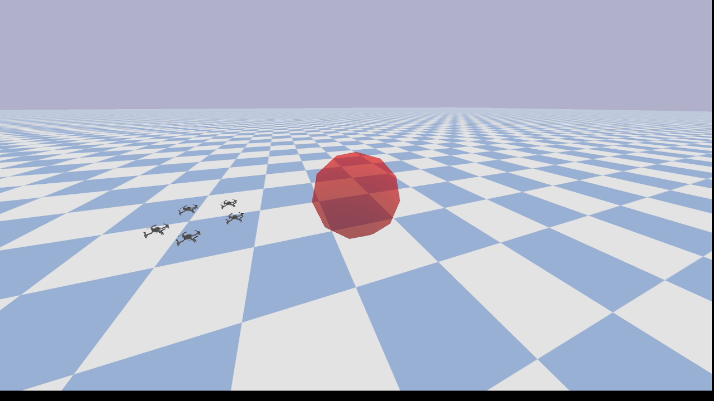
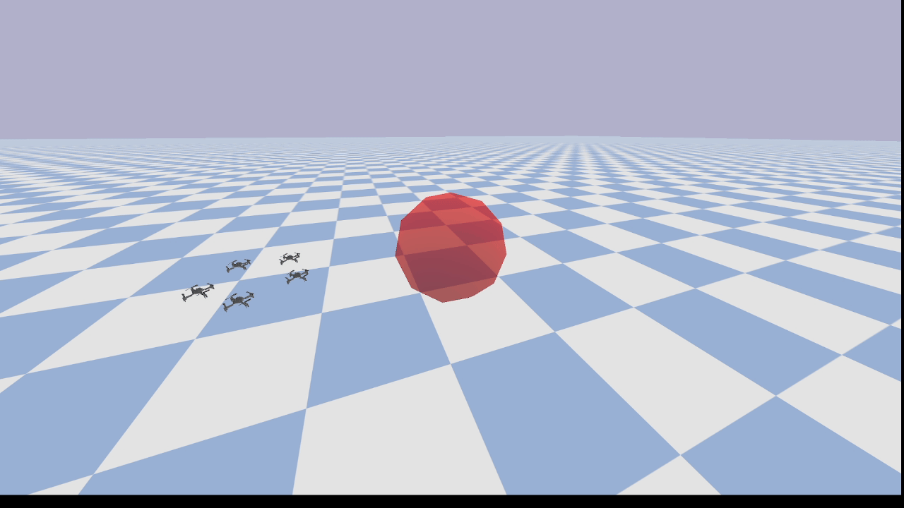
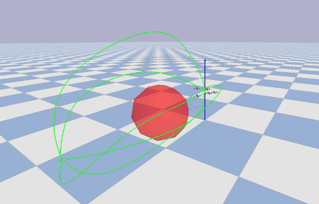

# 🚁 RL + DMP + LMPC + CBF-QP for Multi-Quadrotor Control

[](https://www.python.org/)
[](https://github.com/utiasDSL/gym-pybullet-drones)
[](LICENSE)

This repository implements a **hierarchical control stack** for **single and multi-quadrotor systems**:

- **RL + DMP** for smooth trajectory generation (multi-agent capable)
- **LMPC** to compute **nominal Cartesian velocities** for tracking
- **CBF-QP** safety filter to enforce **inter-drone separation**
- **gym-pybullet-drones** for simulation, dynamics, and low-level control (RPM output)

---

## 🧠 Control Architecture

High-level planning, tracking, and safety are split into a hierchical control:

```text
RL + DMP Trajectory Learning for smooth Cartesian trajectories with obstacle avoidance (full trajectory)
        ↓
LMPC (Nominal Cartesian Velocity), decentralized solver to ensure the constraints over a given horizon (part of the trajectory)
        ↓
CBF-QP Safety Filter (Obstacles + Inter-Drone Avoidance), centralized solver on one single time-step to avoid collisions between drones (single time step)
        ↓
Low-Level PID (gym-pybullet-drones Cartesian velocities -> RPMs)
        ↓
Quadrotor Dynamics (PyBullet)
```

---
## Acknowledgement

The Reinforcement Learning formulation is based on:
> Petar Kormushev, Sylvain Calinon and Darwin G. Caldwell  
> ["Robot Motor Skill Coordination with EM-based Reinforcement Learning."](https://www.researchgate.net/publication/224199135_Robot_Motor_Skill_Coordination_with_EM-based_Reinforcement_Learning) (2010)
Is it implemented with numba for fast computation.

The LMPC problem formulation is based on:  
> Alberto, Nicolas Torres, et al.  
> ["Linear Model Predictive Control in SE(3) for online trajectory planning in dynamic workspaces."](https://hal.science/hal-03790059/document) (2022)

The CBF-QP problem is formulated from:
> Aaron D. Ames, Samuel Coogan, Magnus Egerstedt, Gennaro Notomista, Koushil Sreenath, Paulo Tabuada  
> ["Control Barrier Functions: Theory and Applications."](https://arxiv.org/abs/1903.11199) (2019)

The gym-pybullet-drones can be found at https://utiasdsl.github.io/gym-pybullet-drones/ and is based on:
> Jacopo Panerati and Hehui Zheng and SiQi Zhou and James Xu and Amanda Prorok and Angela P. Schoellig  
> ["Learning to Fly---a Gym Environment with PyBullet Physics for Reinforcement Learning of Multi-agent Quadcopter Control."](https://arxiv.org/abs/2103.02142) (2021)

---
A more detailed repository for the LMPC formulation can be found at: https://github.com/fleurssauvages/LMPC_for_Manipulators

A more detailed repository for the RL formulation, using a 7 DoF robot arm can be found at: https://github.com/fleurssauvages/RL_DMP

---

## 📂 Project Structure

```
├── RL/                     # RL repo, see the global repo for more details
├── MPC/                    # LMPC and QP solver
├── gym_pybullet_drones/    # forked from the named repo for simulation, needs to be donwloaded separately
├── drone_flock_test.py     # a simple test to check the installation
├── traj_RL.py              # computing and testing trajectories with multi-agents
├── traj_RL_LMPC.py         # computing and testing trajectories with multi-agents and decentralized LMPC
├── traj_RL_LMPC_QP.py      # RL, decentralized LMPC and centralized QP
├── README.md
```

---

## ⚡ Installation
You need to download and install gym-drones-pybullet. See their github for more info.

```bash
pip install pybullet numpy scipy matplotlib numba
pip install "numpy<=2.3"
```

---

## 🎥 Demos

<div align="center">

### 🔹 Reinforcement learning for path finding: drones being considered as points, trajectories are not fully safe (obstacles, inter-collisions)


### 🔹 RL and LMPC (decentralized): drones can still inter-collide, but collision with obstacles are avoided


### 🔹 RL and LMPC (decentralized) and CBF-QP (centralized): drones cannot inter-collide anymore


</div>
---

## 🚀 Run the Simulations

- **Simple Quadrotor motion**  
  ```bash
  python drone_flock_test.py
  ```
  Simple test to see if gym-pybullet-drones is correctly installed.

- **RL Traj for Multi-Agent**  
  ```bash
  python traj_RL.py
  ```
  Compute a multiagent trajectory (5 drones) avoiding a static circular obstacle.

- **RL Traj for Multi-Agent with LMPC**  
  ```bash
  python traj_RL_LMPC.py
  ```
  An LMPC ensures the obstacle is avoided over a given time horizon, with a certain margin (i.e all points of the drone). The LMPC, however, being decentralized, does not avoids inter-drone collisions.

- **RL Traj for Multi-Agent with LMPC and CBF QP**  
  ```bash
  python traj_RL_LMPC_QP.py
  ```
  The CBF QP is centralized (single time step) and avoids inter-drones collisions while still ensuring obstacle avoidance.

---

## 📜 License
This project is licensed under the [MIT License](LICENSE).  

---

## ⭐ Acknowledgments
- Inspired by the work of Alberto, Nicolas Torres, et al. (2022).
- Inspired by the work of Petar Kormushev, Sylvain Calinon and Darwin G. Caldwell (2010)
- Inspired by the work of Aaron D. Ames, et al (2019)
- Using the simulator and work of Jacopo Panerati et al (2021)